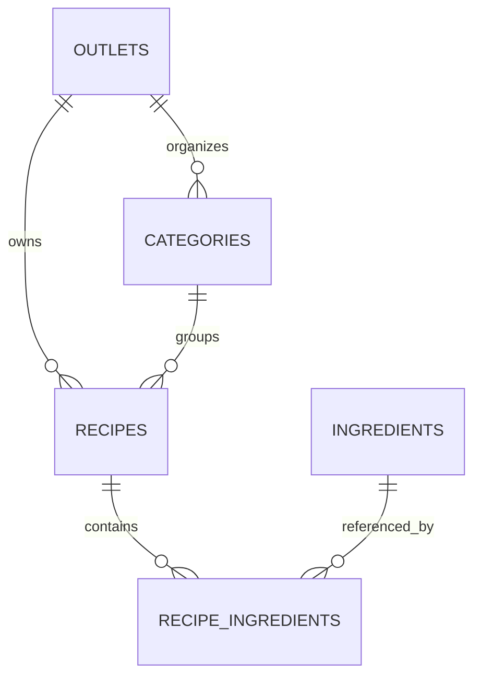
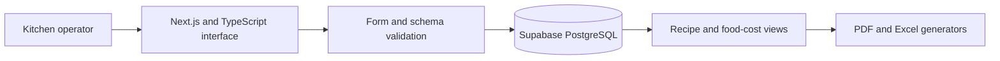

# Kitchen OS

Kitchen OS is a restaurant recipe and food-cost operations prototype built around structured outlets, ingredients, recipes, and exportable production records.

**Status:** Strong prototype. It is not presented as a production system.

## What It Models

The application turns recipe work into connected operational data:

- outlets and outlet-specific recipe categories
- a shared ingredient library with units and unit costs
- recipe master records, yields, preparation details, status, and selling price
- recipe ingredients represented through a relational join model
- allergen flags and form validation
- outlet and global recipe views
- PDF and Excel export workflows

## Data Model

The schema also provides unit lookup values, while recipe and ingredient unit fields remain textual in the current prototype. It uses cascading deletion for outlet-owned categories and recipe rows, while ingredient references are restricted so a shared ingredient cannot be removed while recipes still depend on it. That distinction protects the reusable ingredient library from accidental orphaning.

## Implemented Workflow

1. Create and manage an outlet.
2. Maintain the shared ingredient catalog and cost values.
3. Organize outlet recipes into categories.
4. Build recipes from ingredient rows, yield data, preparation instructions, and allergens.
5. Validate recipe input through typed schemas.
6. Export operational recipe information to PDF or Excel.

## Architecture

## Technology

Next.js, React, TypeScript, Supabase/PostgreSQL, React Hook Form, Zod, jsPDF, jsPDF AutoTable, and SheetJS/XLSX.

## Current Limitations

- The inspected public schema does not provide a complete authentication and Row Level Security model.
- The repository does not contain a complete automated test suite.
- No production deployment or production data is claimed.
- Cost calculations depend on the accuracy and unit consistency of entered ingredient data.

The prototype is useful evidence of relational modeling and operational workflow design, but authentication, authorization, test coverage, and deployment hardening would be required before production use.

## Author

Built by **Göktürk Kahriman**, Full-stack & AI Systems Developer.
